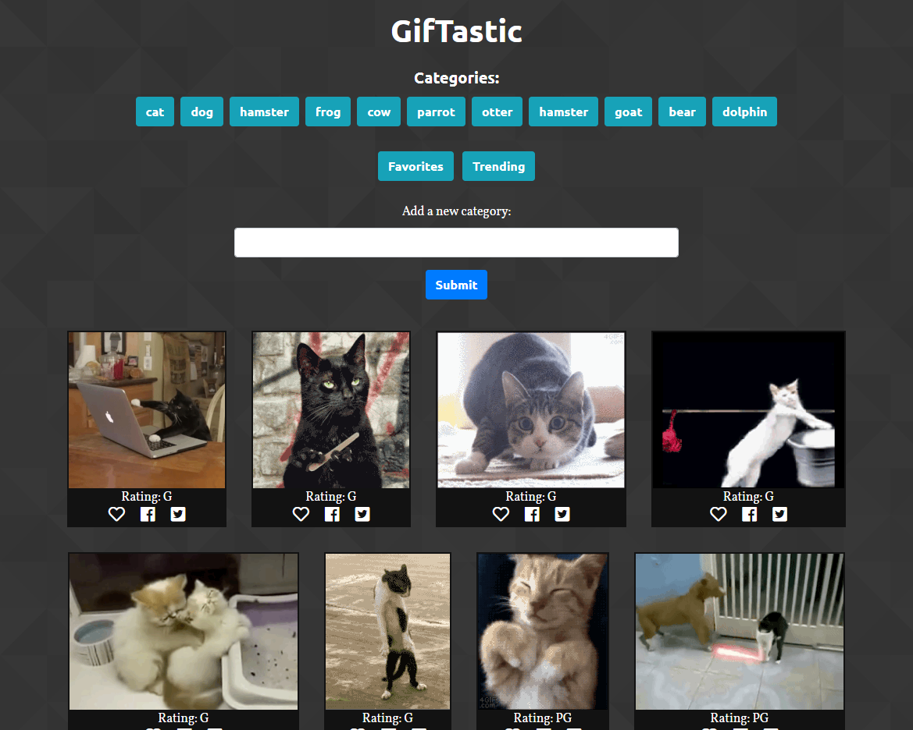

# GifTastic

[Live site](https://dylan-thomson.github.io/GifTastic/)

GifTastic interacts with the GIPHY API to search for and display GIFs. 

Users can click on a category button to get 10 GIFs from that category. These GIFs are loaded as still images, but animate when clicked. The user can click "get more" to load 10 more GIFs from that category. In addition, new categories can be added using a text input field.

Each GIF displays a rating and buttons that allow the user to save it as a favorite, or share on Facebook/Twitter. Saving as a favorite will store the GIF object in local storage, so favorites will persist even if the user closes the browser. These favorites are essentially cached and require no additional API calls to save or display.

This project was created as a homework assignment for the Case Western Web Development Bootcamp. I used Bootstrap, jQuery, and FontAwesome icons.

I recently went back to this project and refactored it, using [ESLint](https://eslint.org/) configured with the Airbnb coding style.
